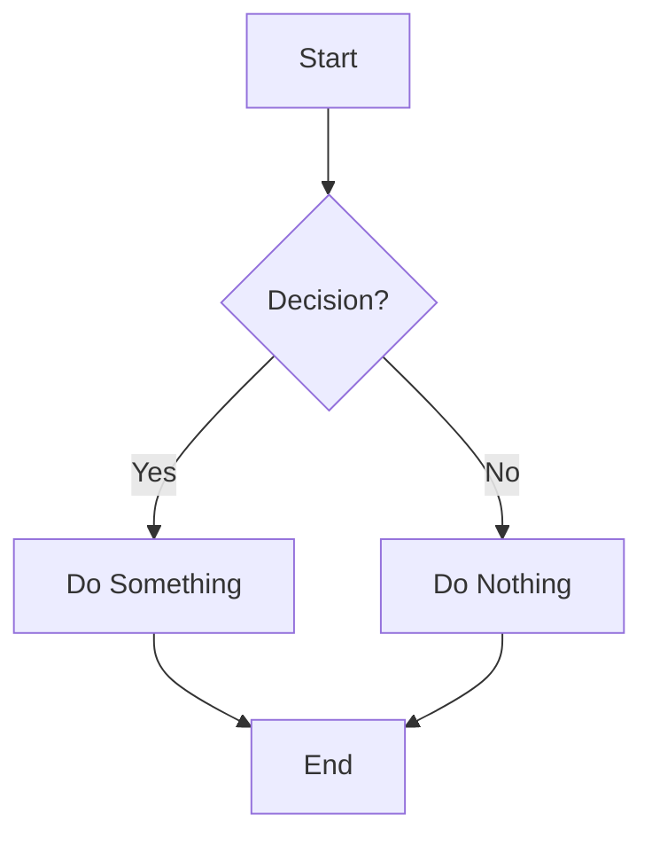
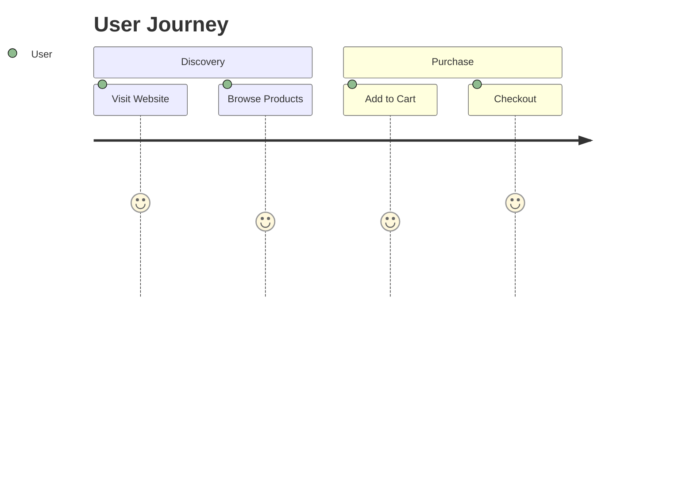
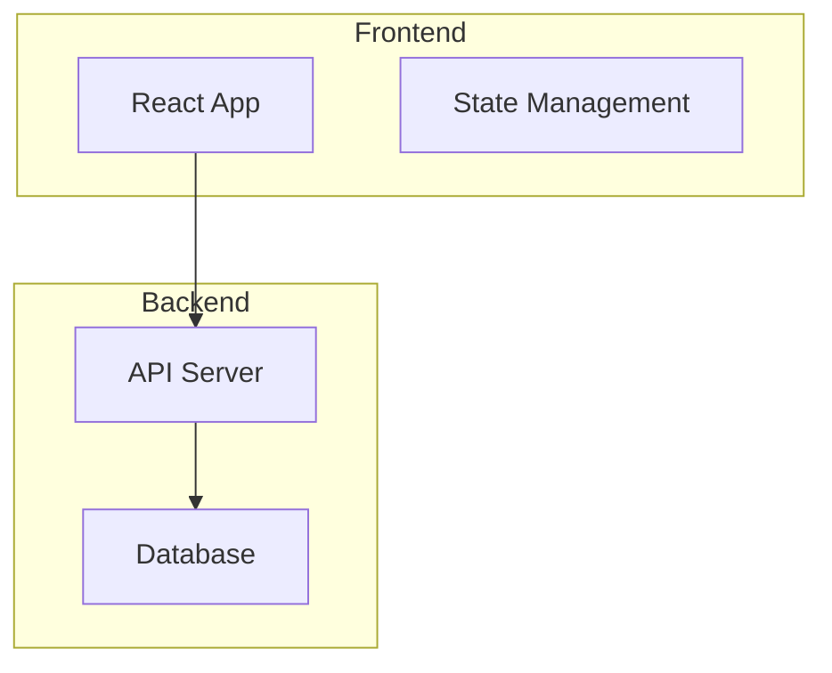

# Mermaid Workflow Generator

A modern, client-side web application for creating and visualizing workflow diagrams using Mermaid.js syntax. Built with Next.js 14, TypeScript, and TailwindCSS.

## ✨ Features

- **Real-time Diagram Rendering**: See your Mermaid diagrams update live as you type
- **Monaco Editor Integration**: Professional code editor with syntax highlighting
- **Smart Validation**: Automatic syntax checking and line count validation (max 400 lines)
- **Export Functionality**: Save diagrams as PNG or SVG with high quality
- **Theme Support**: Toggle between light and dark themes
- **Local Storage**: Auto-save and restore your diagrams
- **Responsive Design**: Works perfectly on desktop and mobile devices
- **Sample Diagrams**: Pre-built examples to get you started quickly

## 🚀 Getting Started

### Prerequisites

- Node.js 18+
- npm or yarn

### Installation

1. Clone the repository:

```bash
git clone <your-repo-url>
cd mermaid-workflow-generator
```

2. Install dependencies:

```bash
npm install
```

3. Run the development server:

```bash
npm run dev
```

4. Open [http://localhost:3000](http://localhost:3000) in your browser

### Building for Production

```bash
npm run build
npm start
```

## 🛠️ Tech Stack

- **Framework**: Next.js 14 with App Router
- **Language**: TypeScript (strict mode)
- **Styling**: TailwindCSS
- **State Management**: Zustand
- **Code Editor**: Monaco Editor
- **Diagram Rendering**: Mermaid.js
- **Export**: html-to-image library
- **Persistence**: localStorage

## 📖 Usage

### Creating Diagrams

1. **Start with a Sample**: Click on any sample diagram to load it into the editor
2. **Write Mermaid Code**: Use the Monaco editor to write your Mermaid syntax
3. **Live Preview**: See your diagram render in real-time on the right side
4. **Save Your Work**: Use the Save button to store diagrams in localStorage

### Mermaid Syntax Examples

#### Basic Flowchart



#### User Journey



#### System Architecture



### Export Options

- **PNG Export**: High-quality PNG images with customizable dimensions
- **SVG Export**: Scalable vector graphics for web use
- **Auto-sizing**: Automatically detects optimal export dimensions

### Theme Switching

Toggle between light and dark themes using the theme button in the control panel. The theme preference is automatically saved and restored.

## 🏗️ Architecture

### State Management

The app uses a sophisticated state machine with Zustand:

- **IdleState**: App just loaded, no code yet
- **EditingState**: User typing/pasting code
- **RenderingState**: Valid code being visualized
- **ErrorState**: Invalid syntax or line count violations
- **ExportState**: Diagram being exported
- **SavedState**: Successfully stored in localStorage

### Component Structure

```
src/
├── components/
│   ├── CodeEditor.tsx      # Monaco editor for Mermaid code
│   ├── DiagramPreview.tsx  # Live diagram rendering
│   ├── ControlPanel.tsx    # Theme, save/load, export controls
│   └── DemoDiagram.tsx     # Sample diagrams
├── hooks/
│   ├── useMermaidRenderer.ts # Mermaid rendering logic
│   └── useExport.ts        # Export functionality
├── store/
│   └── useAppStore.ts      # Zustand state management
├── utils/
│   ├── export.ts           # Export utilities
│   └── validation.ts       # Code validation
└── types/
    └── state.ts            # TypeScript state definitions
```

### Key Features Implementation

- **Debounced Rendering**: 500ms delay prevents excessive re-renders
- **Error Handling**: Comprehensive validation and user-friendly error messages
- **Responsive Design**: Mobile-first approach with TailwindCSS
- **Accessibility**: Proper ARIA labels and keyboard navigation
- **Performance**: Optimized rendering with React hooks and memoization

## 🔧 Configuration

### Environment Variables

No environment variables required - everything runs client-side.

### Customization

- **Theme Colors**: Modify TailwindCSS classes in components
- **Editor Settings**: Adjust Monaco Editor options in `CodeEditor.tsx`
- **Export Quality**: Modify export settings in `useExport.ts`

## 🧪 Testing

The app includes several sample diagrams to test functionality:

1. **Simple Flowchart**: Basic decision flow
2. **User Journey**: Customer experience mapping
3. **System Architecture**: Technical system design
4. **Sequence Diagram**: Process interactions

## 🚀 Deployment

### Vercel (Recommended)

1. Push your code to GitHub
2. Connect your repository to Vercel
3. Deploy automatically on every push

### Other Platforms

The app can be deployed to any static hosting platform:

- Netlify
- GitHub Pages
- AWS S3 + CloudFront
- Any VPS with Node.js

## 🤝 Contributing

1. Fork the repository
2. Create a feature branch
3. Make your changes
4. Add tests if applicable
5. Submit a pull request

## 📝 License

This project is licensed under the MIT License.

## 🙏 Acknowledgments

- [Mermaid.js](https://mermaid.js.org/) for the diagram rendering engine
- [Monaco Editor](https://microsoft.github.io/monaco-editor/) for the code editor
- [Zustand](https://github.com/pmndrs/zustand) for state management
- [TailwindCSS](https://tailwindcss.com/) for the styling framework

## 📞 Support

If you encounter any issues or have questions:

1. Check the [Mermaid.js documentation](https://mermaid.js.org/)
2. Review the browser console for error messages
3. Open an issue on GitHub

---

**Happy diagramming! 🎨**
